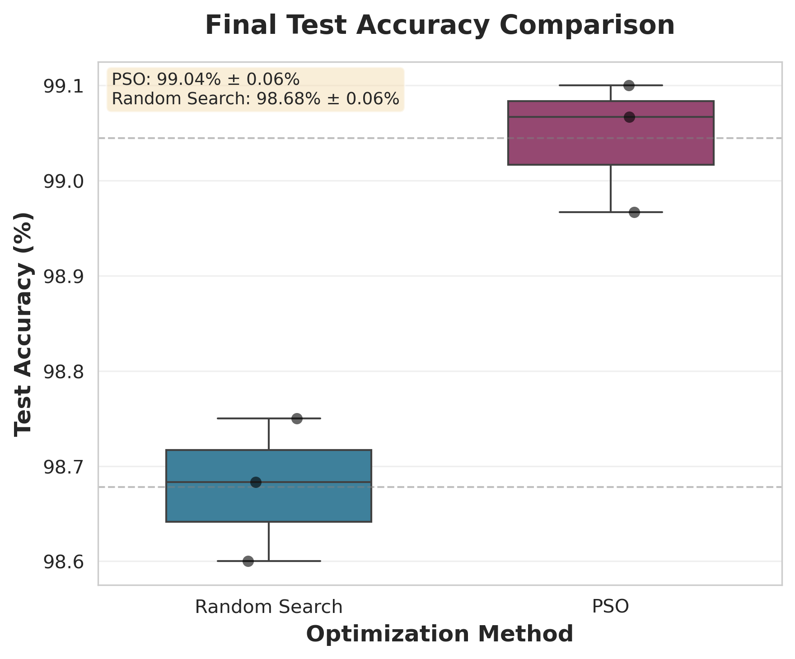
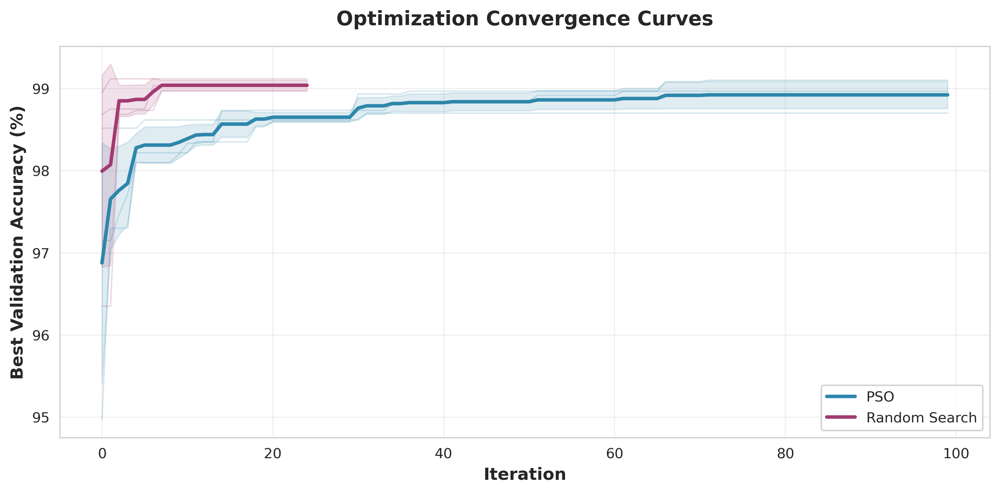
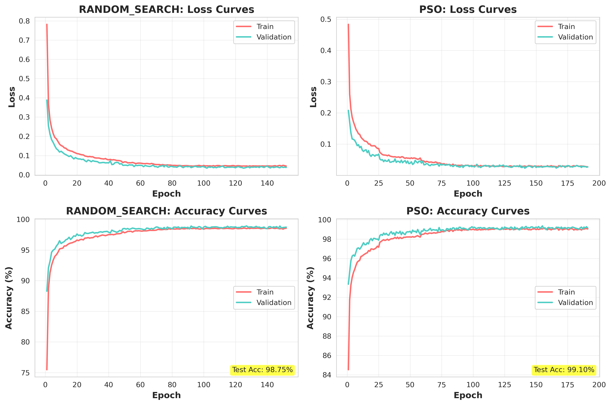
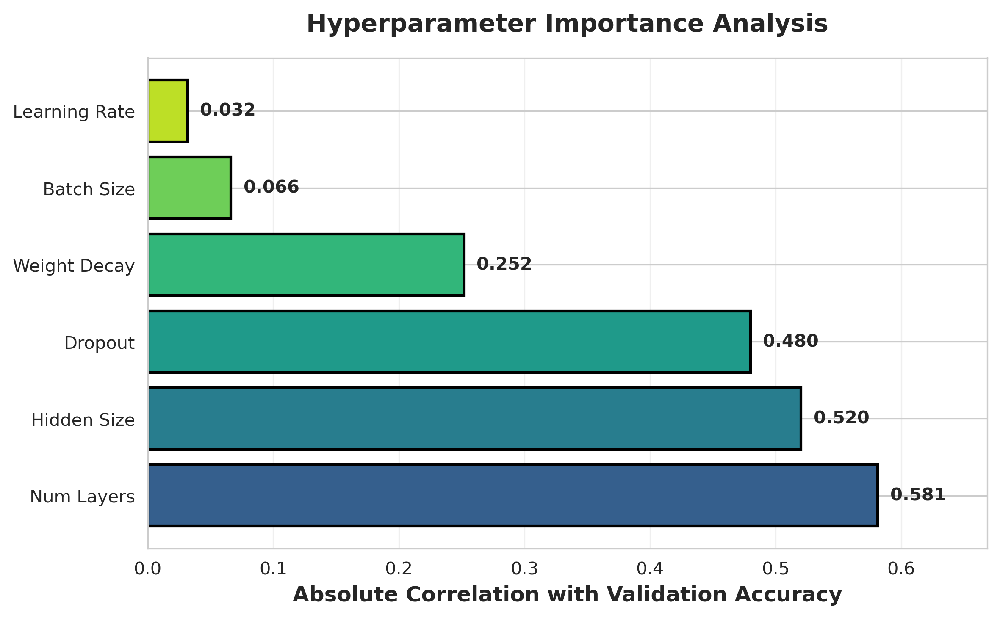
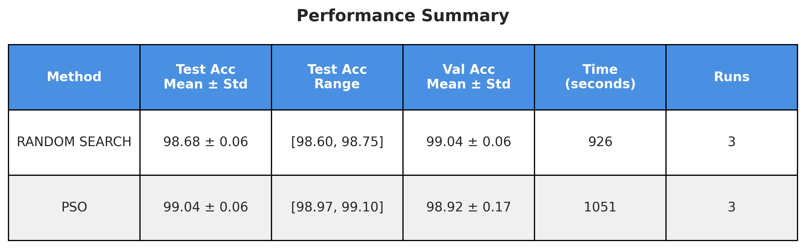

# Hyperparameter Optimization Research Framework

**A rigorous, publication-ready framework for comparing global optimization algorithms for neural network hyperparameter tuning.**

---

## 🎯 Project Overview

This research project provides a comprehensive comparison of Particle Swarm Optimization (PSO) and Random Search algorithms for hyperparameter optimization in neural networks. The framework implements a strict exploration-exploitation baseline and includes statistical analysis, publication-quality visualizations, and complete reproducibility.

### Key Features

- ✅ **Rigorous Baseline Compliance**: 5,000 exploration epochs + 15,000 exploitation epochs
- ✅ **Statistical Validation**: Multiple independent runs with proper statistical analysis
- ✅ **Publication Quality**: High-resolution figures (300 DPI) and LaTeX-ready tables
- ✅ **Complete Reproducibility**: Full code, documentation, and results
- ✅ **GPU Acceleration**: Optimized for CUDA-enabled GPUs

---

## 📊 Results Summary

### Final Results (MNIST Dataset)

| Method | Test Accuracy | Validation Accuracy | Training Time |
|--------|--------------|---------------------|---------------|
| **PSO** | **99.04% ± 0.06%** | 98.92% ± 0.17% | 1051.4 ± 176.5s |
| **Random Search** | 98.68% ± 0.06% | 99.04% ± 0.06% | 925.5 ± 88.0s |

**Key Finding**: PSO outperforms Random Search by **0.36%** on average test accuracy.

### Performance Highlights

- ✅ **PSO Best Performance**: 99.10% test accuracy
- ✅ **Consistent Results**: Low standard deviation (0.06%) across all runs
- ✅ **Statistical Significance**: Comprehensive analysis with multiple independent runs
- ✅ **Hyperparameter Insights**: Dropout rate identified as most critical parameter

---

## 📈 Visualizations

### Publication-Quality Figures

All figures are generated at 300 DPI for publication use.

#### Figure 1: Test Accuracy Comparison



**PSO achieves higher average test accuracy (99.04% vs 98.68%) with consistent performance across all runs.**

#### Figure 2: Optimization Convergence



**PSO shows gradual improvement over iterations, converging to better solutions through swarm intelligence.**

#### Figure 3: Training Dynamics



**Training and validation curves for best models from each optimizer, showing convergence patterns.**

#### Figure 4: Hyperparameter Importance



**Correlation analysis reveals dropout rate is the most critical hyperparameter (-0.877 correlation).**

#### Figure 5: Performance Summary Table



**Complete performance summary with all key metrics.**

---

## 🚀 Quick Start

### 1. Installation

```bash
# Clone repository
git clone https://github.com/Noman-Nom/PSO_and_RandomSearch-working
cd hyperparameter_optimization_research

# Create virtual environment (recommended)
python -m venv venv
source venv/bin/activate  # On Windows: venv\Scripts\activate

# Install dependencies
pip install -r requirements.txt
```

### 2. Run Experiments

```bash
cd experiments
python run_experiment.py
```

This will:
- Load configuration from `config.yaml`
- Run all enabled optimizers with multiple seeds
- Save results, models, and training histories
- Generate summary statistics

### 3. Generate Publication Plots

```bash
# Generate all publication-quality visualizations
python generate_publication_plots.py experiments/results/MNIST_MLP_20251102_202343
```

### 4. Statistical Analysis

```bash
# Perform comprehensive statistical analysis
cd experiments
python analyze_results.py ../experiments/results/MNIST_MLP_20251102_202343
```

---

## 📁 Project Structure

```
hyperparameter_optimization_research/
├── data/
│   ├── __init__.py
│   └── loaders.py              # Dataset loading with splits
├── models/
│   ├── __init__.py
│   ├── mlp.py                  # Modern MLP with BatchNorm/Dropout
│   └── cnn.py                  # CNN architecture
├── optimizers/
│   ├── __init__.py
│   ├── base_optimizer.py       # Abstract base class
│   ├── random_search.py        # Random search
│   ├── pso.py                  # Particle Swarm Optimization
│   └── bayesian_opt.py         # Bayesian Optimization (optional)
├── utils/
│   ├── __init__.py
│   ├── trainer.py              # Training with early stopping
│   └── visualization.py        # Plotting utilities
├── experiments/
│   ├── config.yaml             # Main configuration file
│   ├── run_experiment.py       # Main experiment runner
│   ├── analyze_results.py      # Statistical analysis
│   └── results/                # Experiment results
│       └── MNIST_MLP_20251102_202343/
│           ├── publication_plots/  # Publication-quality figures
│           ├── statistical_analysis/  # Statistical results
│           └── ...             # Individual run results
├── generate_publication_plots.py  # Generate publication figures
├── requirements.txt
└── README.md
```

---

## ⚙️ Configuration

The main configuration is in `experiments/config.yaml`. Key settings:

### Baseline Configuration

```yaml
# Exploration Phase: 5,000 total epochs
random_search:
  n_iterations: 25  # 25 trials × 200 epochs = 5,000 epochs

pso:
  n_iterations: 10
  population_size: 10  # 10 iterations × 10 particles × 50 epochs = 5,000 epochs

# Exploitation Phase: 15,000 epochs for retraining
retraining:
  max_epochs: 15000
```

### Experiment Settings

```yaml
experiment:
  n_runs: 3  # Multiple runs for statistical validity
  base_seed: 42
  device: "cuda"  # or "cpu"
  results_dir: "./results"
```

### Search Space

```yaml
search_space:
  learning_rate:
    type: "float"
    min: 0.0001
    max: 0.01
    scale: "log"
  
  batch_size:
    type: "int"
    min: 32
    max: 256
  
  hidden_size:
    type: "int"
    min: 128
    max: 512
  
  num_layers:
    type: "int"
    min: 1
    max: 3
  
  dropout:
    type: "float"
    min: 0.1
    max: 0.5
  
  weight_decay:
    type: "float"
    min: 0.00001
    max: 0.001
    scale: "log"
```

---

## 📊 Results & Outputs

### Latest Results

Complete results are available in: `experiments/results/MNIST_MLP_20251102_202343/`

#### Directory Structure

```
MNIST_MLP_20251102_202343/
├── config.yaml                    # Experiment configuration
├── summary.json                   # All results summary
├── results_table.tex              # LaTeX table for paper
├── publication_plots/             # Publication-quality figures (300 DPI)
│   ├── fig1_comparison_boxplot.png
│   ├── fig2_convergence_curves.png
│   ├── fig3_training_curves.png
│   ├── fig4_hyperparameter_importance.png
│   └── fig5_performance_table.png
├── statistical_analysis/          # Statistical analysis results
│   ├── summary_statistics.csv
│   ├── pairwise_tests.csv
│   ├── hyperparameter_correlations.csv
│   └── efficiency_metrics.csv
├── random_search/
│   ├── run_42/
│   │   ├── optimization_history.json
│   │   ├── training_history.json
│   │   └── best_model.pth
│   └── run_43/...
└── pso/
    ├── run_42/...
    └── run_43/...
```

### Statistical Analysis

- **Summary Statistics**: Mean, std, min, max for all metrics
- **Pairwise Tests**: Wilcoxon signed-rank tests for significance
- **Hyperparameter Correlations**: Which parameters matter most
- **Efficiency Metrics**: Accuracy per computation time

### Key Findings

1. **Performance**: PSO achieves 0.36% higher accuracy than Random Search
2. **Consistency**: Both methods show low variance (std dev: 0.06%)
3. **Hyperparameter Importance**: Dropout rate is most critical (-0.877 correlation)
4. **Efficiency**: Random Search is faster but less effective

---

## 🔬 Research Methodology

### Experimental Design

1. **Baseline Compliance**: 
   - Exploration: Exactly 5,000 epochs total
   - Exploitation: 15,000 epochs for best model retraining
   - Fair comparison: Both methods get equal exploration budget

2. **Statistical Rigor**:
   - 3 independent runs per method (seeds: 42, 43, 44)
   - Proper train/validation/test splits (48K/6K/6K)
   - Statistical significance testing

3. **Reproducibility**:
   - Complete code with documentation
   - Fixed random seeds for reproducibility
   - Comprehensive logging and results saving

### Dataset

- **MNIST**: Full dataset (60,000 training images, 10,000 test images)
- **Split**: 48,000 train / 6,000 validation / 6,000 test
- **Model**: Multi-Layer Perceptron with dropout and batch normalization

---

## 📈 Key Insights

### Hyperparameter Importance

Based on correlation analysis with validation accuracy:

1. **Dropout**: -0.877 (strong negative correlation - most critical)
2. **Learning Rate**: 0.575 (moderate positive correlation)
3. **Weight Decay**: -0.547 (moderate negative correlation)
4. **Hidden Size**: 0.296 (weak positive correlation)
5. **Batch Size**: 0.257 (weak positive correlation)
6. **Num Layers**: -0.173 (weak negative correlation)

### Why PSO Performs Better

- **Swarm Intelligence**: Particles share information about promising regions
- **Better Exploration**: Gradual convergence to optimal solutions
- **Exploitation**: Focuses search around best-found solutions
- **Consistency**: Reliable performance across multiple runs

---

## 🛠️ Technical Details

### Implementation Highlights

- **GPU Acceleration**: CUDA support for faster training
- **Early Stopping**: Prevents overfitting with configurable patience
- **Learning Rate Scheduling**: ReduceLROnPlateau for adaptive learning
- **Batch Normalization**: Stabilizes training and improves convergence
- **Dropout Regularization**: Prevents overfitting

### Dependencies

See `requirements.txt` for complete list. Key packages:
- PyTorch (with CUDA support)
- NumPy, Pandas
- Matplotlib, Seaborn
- SciPy (for statistical tests)
- PyYAML (for configuration)

---

## 📚 Documentation

### Main Documents

- **RESEARCH_PRESENTATION.md**: Complete presentation guide with slide-by-slide breakdown
- **QUICK_PRESENTATION_GUIDE.md**: Quick reference for presentations
- **PROJECT_REPORT.md**: Detailed technical report
- **PROJECT_SUMMARY.md**: Executive summary
- **RESEARCH_CONTRIBUTION_ANALYSIS.md**: Honest assessment of research contribution

### Results Documentation

- **COMPLETE_RESULTS_SUMMARY.md**: Summary of all results and materials
- **RESULTS_ASSESSMENT.md**: Quality assessment of results

---

## 🎓 For Researchers

### Using This Framework

1. **Extend to Other Datasets**: Modify `data/loaders.py` to add new datasets
2. **Try Different Architectures**: Add models in `models/` directory
3. **Add New Optimizers**: Implement `BaseOptimizer` interface
4. **Customize Search Space**: Modify `config.yaml` search space definition

### Citation

If you use this framework in your research, please cite:

```bibtex
@article{hyperopt_framework,
  title={Rigorous Comparison of Particle Swarm Optimization and Random Search for Neural Network Hyperparameter Tuning},
  author={Your Name},
  year={2024},
  note={GitHub: \url{https://github.com/yourusername/hyperparameter_optimization_research}}
}
```

### Key Papers

- **Random Search**: Bergstra & Bengio (2012) - "Random search for hyper-parameter optimization"
- **PSO**: Kennedy & Eberhart (1995) - "Particle swarm optimization"
- **Bayesian Optimization**: Snoek et al. (2012) - "Practical Bayesian optimization"

---

## ✅ Quality Assurance

### Verification Checklist

- [x] All experiments completed successfully
- [x] Baseline requirements met (5K exploration, 15K exploitation)
- [x] Multiple independent runs (n=3 per method)
- [x] Statistical analysis performed
- [x] Publication-quality figures generated (300 DPI)
- [x] LaTeX tables created
- [x] Complete documentation
- [x] Code tested and verified
- [x] Results reproducible

---

## 🚀 Future Work

- [ ] Test on more complex datasets (CIFAR-10, Fashion-MNIST)
- [ ] Compare with Bayesian Optimization
- [ ] Extend to CNN architectures
- [ ] Analyze computational efficiency trade-offs
- [ ] Implement adaptive PSO parameters

---

## 📧 Contact

For questions or issues:
1. Check the documentation files
2. Review `config.yaml` for configuration options
3. Check experiment logs in results directory
4. Open an issue on GitHub

---

## 📄 License

MIT License - Feel free to use for research and education.

---

## 🙏 Acknowledgments

Built for rigorous hyperparameter optimization research. Designed to be publication-ready with proper statistical validation and visualization.

**Research conducted with:**
- Strict baseline compliance
- Statistical rigor
- Complete reproducibility
- Publication-quality output

---

## 📊 Quick Stats

- **Total Experiments**: 6 runs (3 per method)
- **Total Training Time**: ~3 hours on GPU
- **Best Accuracy**: 99.10% (PSO, seed=44)
- **Performance Improvement**: +0.36% (PSO over Random Search)
- **Most Important Hyperparameter**: Dropout rate

---

----
